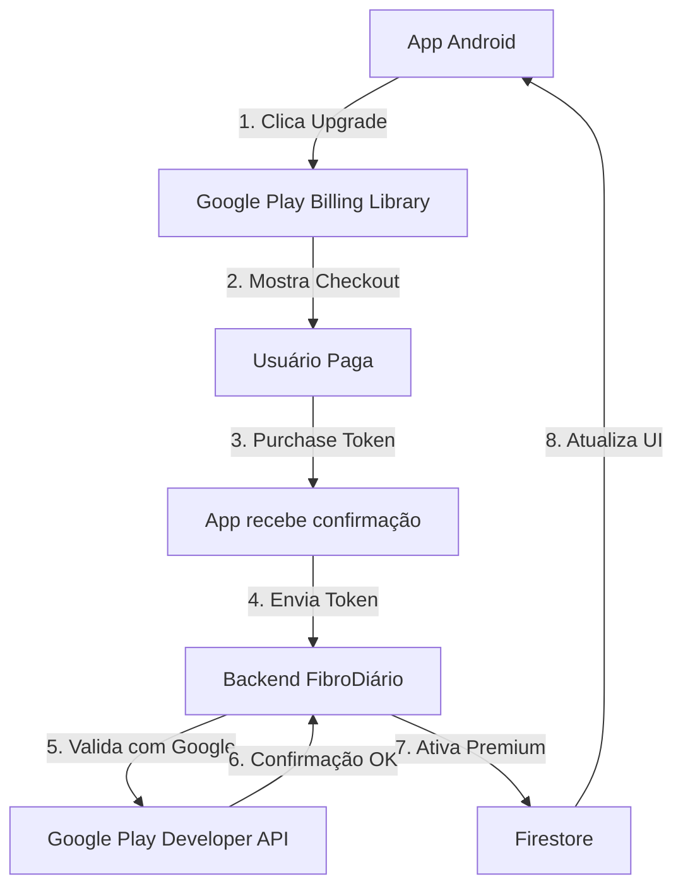

# 🛒 Google Play Billing - Integração FibroDiário

**Data:** 24 de novembro de 2025  
**Sistema de Assinaturas:** Google Play Store

---

## 📋 Visão Geral

O FibroDiário usa **Google Play Billing** para gerenciar assinaturas Premium. Este documento detalha a integração técnica, setup, e validação server-side.

### Por que Google Play Billing?

- ✅ **Integrado ao Android** - Usuários já têm métodos de pagamento salvos
- ✅ **Gerenciamento automático** - Google cuida de cobranças, cancelamentos, reembolsos
- ✅ **Familiaridade** - Mesma experiência de outros apps
- ✅ **Sem PCI compliance** - Google handle todos os dados de pagamento

---

## 🏗️ Arquitetura



---

## 🛠️ Setup Google Play Console

### Passo 1: Criar Produto de Assinatura

1. **Acessar Play Console**
   ```
   https://play.google.com/console → App FibroDiário
   → Monetization → Subscriptions
   ```

2. **Criar Nova Assinatura**
   ```
   Product ID: fibrodiario_premium_monthly
   Nome: FibroDiário Premium
   Descrição: Acesso completo a todos os recursos
   ```

3. **Configurar Preço**
   ```
   País: Brasil
   Preço: R$ 19,90
   Período: Mensal (P1M)
   Trial: 14 dias grátis
   ```

4. **Base Plan & Offers**
   ```
   Base Plan ID: monthly-base
   Billing Period: Every month
   Grace Period: 3 days (para falhas de pagamento)
   ```

### Passo 2: Configurar Service Account

1. **Criar Service Account**
   ```
   Google Cloud Console → IAM & Admin → Service Accounts
   → Create Service Account
   
   Nome: fibrodiario-billing-validator
   Role: Monitoring Viewer (para APIs)
   ```

2. **Gerar Chave JSON**
   ```
   Service Account → Keys → Add Key → Create new key → JSON
   
   Salvar: service-account-key.json
   ```

3. **Habilitar API**
   ```
   Google Play Developer API → Enable API
   ```

4. **Vincular ao Play Console**
   ```
   Play Console → Users and permissions → Invite new users
   → Email: service-account@...
   → Grant access to: Financial data, View-only
   ```

---

## 💻 Implementação Frontend (Android)

### Dependências (build.gradle)

```gradle
dependencies {
    // Google Play Billing Library
    implementation 'com.android.billingclient:billing:6.1.0'
    implementation 'com.android.billingclient:billing-ktx:6.1.0'
}
```

### BillingManager.kt

```kotlin
class BillingManager(
    private val context: Context,
    private val onPurchaseSuccess: (purchaseToken: String) -> Unit
) {
    private lateinit var billingClient: BillingClient
    
    init {
        setupBillingClient()
    }
    
    private fun setupBillingClient() {
        billingClient = BillingClient.newBuilder(context)
            .setListener { billingResult, purchases ->
                if (billingResult.responseCode == BillingClient.BillingResponseCode.OK) {
                    purchases?.forEach { handlePurchase(it) }
                }
            }
            .enablePendingPurchases()
            .build()
            
        billingClient.startConnection(object : BillingClientStateListener {
            override fun onBillingSetupFinished(billingResult: BillingResult) {
                if (billingResult.responseCode == BillingClient.BillingResponseCode.OK) {
                    Log.d("Billing", "✅ Billing Client ready")
                }
            }
            
            override fun onBillingServiceDisconnected() {
                Log.w("Billing", "⚠️ Billing Client disconnected")
            }
        })
    }
    
    /**
     * Inicia fluxo de compra Premium
     */
    fun purchasePremium(activity: Activity) {
        val productDetails = queryProductDetails()
        
        val productDetailsParamsList = listOf(
            BillingFlowParams.ProductDetailsParams.newBuilder()
                .setProductDetails(productDetails)
                .setOfferToken(productDetails.subscriptionOfferDetails?.get(0)?.offerToken!!)
                .build()
        )
        
        val billingFlowParams = BillingFlowParams.newBuilder()
            .setProductDetailsParamsList(productDetailsParamsList)
            .build()
        
        billingClient.launchBillingFlow(activity, billingFlowParams)
    }
    
    /**
     * Query detalhes do produto
     */
    private fun queryProductDetails(): ProductDetails {
        val queryProductDetailsParams = QueryProductDetailsParams.newBuilder()
            .setProductList(
                listOf(
                    QueryProductDetailsParams.Product.newBuilder()
                        .setProductId("fibrodiario_premium_monthly")
                        .setProductType(BillingClient.ProductType.SUBS)
                        .build()
                )
            )
            .build()
        
        var details: ProductDetails? = null
        
        billingClient.queryProductDetailsAsync(queryProductDetailsParams) { billingResult, productDetailsList ->
            if (billingResult.responseCode == BillingClient.BillingResponseCode.OK) {
                details = productDetailsList.firstOrNull()
            }
        }
        
        return details!!
    }
    
    /**
     * Handle compra concluída
     */
    private fun handlePurchase(purchase: Purchase) {
        if (purchase.purchaseState == Purchase.PurchaseState.PURCHASED) {
            if (!purchase.isAcknowledged) {
                // Enviar para backend validar
                val purchaseToken = purchase.purchaseToken
                onPurchaseSuccess(purchaseToken)
                
                // Acknowledge purchase
                val acknowledgePurchaseParams = AcknowledgePurchaseParams.newBuilder()
                    .setPurchaseToken(purchaseToken)
                    .build()
                    
                billingClient.acknowledgePurchase(acknowledgePurchaseParams) { billingResult ->
                    if (billingResult.responseCode == BillingClient.BillingResponseCode.OK) {
                        Log.d("Billing", "✅ Purchase acknowledged")
                    }
                }
            }
        }
    }
}
```

### Uso no React Native / Capacitor

Se estiver usando React Native ou Capacitor (para PWA):

```typescript
// Usando @awesome-cordova-plugins/purchase ou react-native-iap

import { InAppPurchase } from '@awesome-cordova-plugins/purchase';

// Registrar produto
InAppPurchase.register({
  id: 'fibrodiario_premium_monthly',
  type: InAppPurchase.PAID_SUBSCRIPTION,
});

// Comprar
InAppPurchase.order('fibrodiario_premium_monthly')
  .then((data) => {
    // Enviar purchaseToken para backend
    const purchaseToken = data.transaction.transactionReceipt;
    validatePurchase(purchaseToken);
  });
```

---

## 🔧 Backend - Validação Server-Side

### Dependências (Node.js)

```json
{
  "dependencies": {
    "googleapis": "^128.0.0",
    "express": "^4.18.2"
  }
}
```

### Google Play Validator Service

```typescript
// server/services/googlePlayValidator.ts

import { google } from 'googleapis';
import { JWT } from 'google-auth-library';

const PACKAGE_NAME = 'com.fibrodiario.app';
const SERVICE_ACCOUNT_KEY = JSON.parse(
  process.env.GOOGLE_PLAY_SERVICE_ACCOUNT_KEY || '{}'
);

/**
 * Valida purchase token com Google Play Developer API
 */
export async function validateGooglePlayPurchase(
  purchaseToken: string,
  subscriptionId: string = 'fibrodiario_premium_monthly'
): Promise<{
  valid: boolean;
  orderId?: string;
  expiryTime?: number;
  autoRenewing?: boolean;
}> {
  try {
    // Autenticar com Service Account
    const authClient = new JWT({
      email: SERVICE_ACCOUNT_KEY.client_email,
      key: SERVICE_ACCOUNT_KEY.private_key,
      scopes: ['https://www.googleapis.com/auth/androidpublisher'],
    });

    // Criar cliente da API
    const androidPublisher = google.androidpublisher({
      version: 'v3',
      auth: authClient,
    });

    // Validar assinatura
    const response = await androidPublisher.purchases.subscriptions.get({
      packageName: PACKAGE_NAME,
      subscriptionId,
      token: purchaseToken,
    });

    const subscription = response.data;

    console.log('📋 Google Play Subscription:', subscription);

    // Verificar se está ativa
    const now = Date.now();
    const expiryTime = parseInt(subscription.expiryTimeMillis || '0');
    const isActive = expiryTime > now;

    return {
      valid: isActive,
      orderId: subscription.orderId,
      expiryTime,
      autoRenewing: subscription.autoRenewing || false,
    };
  } catch (error) {
    console.error('❌ Erro ao validar purchase:', error);
    return { valid: false };
  }
}
```

### API Endpoint - Ativar Premium

```typescript
// server/routes.ts

import { validateGooglePlayPurchase } from './services/googlePlayValidator';
import { db } from './firebase';
import { doc, updateDoc, Timestamp } from 'firebase/firestore';

/**
 * POST /api/subscription/activate
 * Ativa Premium após validar purchase token
 */
app.post('/api/subscription/activate', async (req, res) => {
  const { userId, purchaseToken, subscriptionId } = req.body;

  if (!userId || !purchaseToken) {
    return res.status(400).json({ error: 'Missing required fields' });
  }

  try {
    // 1. Validar com Google Play API
    const validation = await validateGooglePlayPurchase(purchaseToken, subscriptionId);

    if (!validation.valid) {
      return res.status(403).json({ error: 'Invalid purchase token' });
    }

    // 2. Ativar Premium no Firestore
    const userRef = doc(db, 'usuarios', userId);
    
    await updateDoc(userRef, {
      subscriptionTier: 'premium',
      subscriptionStatus: 'active',
      isSubscriptionActive: true,
      subscriptionStartDate: Timestamp.now(),
      subscriptionEndDate: Timestamp.fromMillis(validation.expiryTime!),
      
      // Google Play data
      googlePlayPurchaseToken: purchaseToken,
      googlePlaySubscriptionId: subscriptionId,
      googlePlayOrderId: validation.orderId,
      
      // Premium features
      features: {
        nlpAnalysis: true,
        unlimitedHistory: true,
        advancedReports: true,
        unlimitedDoctors: true,
        exportData: true,
        prioritySupport: true,
        pushNotifications: true,
      },
      
      updatedAt: Timestamp.now(),
    });

    console.log(`✅ Premium ativado para ${userId}`);

    res.json({
      success: true,
      message: 'Premium activated',
      expiryTime: validation.expiryTime,
    });
  } catch (error) {
    console.error('❌ Erro ao ativar Premium:', error);
    res.status(500).json({ error: 'Internal server error' });
  }
});
```

---

## 🔄 Renovação Automática

### Real-time Developer Notifications (RTDN)

Google envia notificações de eventos de assinatura para seu backend:

1. **Setup no Play Console**
   ```
   Monetization → Subscriptions → Settings
   → Real-time developer notifications
   → Topic name: fibrodiario-subscriptions
   ```

2. **Webhook Endpoint**
   ```typescript
   // server/routes.ts
   
   app.post('/api/webhooks/google-play', async (req, res) => {
     const notification = req.body;
     
     // Decode Pub/Sub message
     const data = Buffer.from(notification.message.data, 'base64').toString();
     const event = JSON.parse(data);
     
     console.log('📬 Google Play Notification:', event);
     
     const { subscriptionNotification } = event;
     const notificationType = subscriptionNotification?.notificationType;
     
     switch (notificationType) {
       case 1: // SUBSCRIPTION_RECOVERED
         await handleSubscriptionRecovered(event);
         break;
       
       case 2: // SUBSCRIPTION_RENEWED
         await handleSubscriptionRenewed(event);
         break;
       
       case 3: // SUBSCRIPTION_CANCELED
         await handleSubscriptionCanceled(event);
         break;
       
       case 4: // SUBSCRIPTION_PURCHASED
         await handleSubscriptionPurchased(event);
         break;
       
       case 13: // SUBSCRIPTION_EXPIRED
         await handleSubscriptionExpired(event);
         break;
     }
     
     res.sendStatus(200);
   });
   
   async function handleSubscriptionRenewed(event: any) {
     const { purchaseToken } = event.subscriptionNotification;
     
     // Extender subscriptionEndDate
     const validation = await validateGooglePlayPurchase(purchaseToken);
     
     // Atualizar Firestore com nova data de expiração
     // ...
   }
   
   async function handleSubscriptionExpired(event: any) {
     const { purchaseToken } = event.subscriptionNotification;
     
     // Downgrade para Free
     // ...
   }
   ```

---

## 🧪 Testing

### Teste Local (Sandbox)

1. **Adicionar conta de teste**
   ```
   Play Console → Setup → License testing
   → Add testers: seu-email@gmail.com
   ```

2. **Testar compra**
   - Usar conta de teste no dispositivo
   - Pagamento não cobra de verdade
   - Assinatura expira em 5 minutos (ao invés de 1 mês)

### Validação Manual

```bash
# Validar purchase token manualmente
curl -X GET \
  "https://androidpublisher.googleapis.com/androidpublisher/v3/applications/com.fibrodiario.app/purchases/subscriptions/fibrodiario_premium_monthly/tokens/{PURCHASE_TOKEN}?access_token={ACCESS_TOKEN}"
```

---

## 💰 Custos e Taxas

### Google Play Taxa

```
Taxa padrão: 15% (primeiros $1M/ano)
Taxa reduzida: 30% (após $1M/ano)

Exemplo FibroDiário:
Usuário paga: R$ 19,90
Google fica: R$ 2,99 (15%)
FibroDiário recebe: R$ 16,91 (85%)
```

### Comparação vs Stripe

| Aspecto | Google Play | Stripe |
|---------|-------------|--------|
| Taxa | 15% | 2,9% + R$ 0,30 |
| Setup | Complexo | Simples |
| Integração | Android nativo | Web/qualquer |
| Pagamentos | Play Store | Cartão direto |
| Trial | Automático | Manual |

---

## 📊 Monitoramento

### Métricas no Play Console

```
Monetization → Reports:
- Active subscriptions
- Churn rate
- Trial conversions
- Revenue
```

### Backend Logging

```typescript
// Adicionar analytics
analytics.track('subscription_activated', {
  userId,
  orderId,
  platform: 'google_play',
  value: 19.90,
});
```

---

## 🔒 Segurança

### Validação Server-Side (OBRIGATÓRIO)

⚠️ **NUNCA confie apenas no cliente!**

```typescript
// ❌ ERRADO: Confiar no cliente
if (clientSays.isPremium) {
  grantAccess();
}

// ✅ CORRETO: Validar no backend
const validation = await validateGooglePlayPurchase(purchaseToken);
if (validation.valid) {
  grantAccess();
}
```

### Service Account Key

```bash
# NUNCA commitar service-account-key.json
echo "service-account-key.json" >> .gitignore

# Usar environment variable
export GOOGLE_PLAY_SERVICE_ACCOUNT_KEY='{"type":"service_account",...}'
```

---

## 🚨 Troubleshooting

### Purchase token inválido

```
Erro: "The purchase token was not found"

Soluções:
1. Verificar se produto está publicado no Play Console
2. Confirmar que PACKAGE_NAME está correto
3. Testar com conta de teste licenciada
4. Aguardar alguns minutos (propagação)
```

### API não retorna dados

```
Erro: 403 Forbidden

Soluções:
1. Verificar se Google Play Developer API está habilitada
2. Confirmar que Service Account tem permissões
3. Verificar se está vinculada ao Play Console
4. Regenerar chave JSON
```

---

## ✅ Checklist de Implementação

- [ ] Criar produto de assinatura no Play Console
- [ ] Configurar preço R$ 19,90 mensal
- [ ] Habilitar trial de 14 dias
- [ ] Criar Service Account
- [ ] Gerar chave JSON
- [ ] Habilitar Google Play Developer API
- [ ] Vincular Service Account ao Play Console
- [ ] Implementar BillingManager no Android
- [ ] Criar endpoint /api/subscription/activate
- [ ] Implementar validateGooglePlayPurchase()
- [ ] Setup webhook RTDN
- [ ] Testar com conta de teste
- [ ] Validar renovação automática
- [ ] Monitorar logs de produção

---

## 📚 Recursos

- [Google Play Billing Docs](https://developer.android.com/google/play/billing)
- [Android Publisher API](https://developers.google.com/android-publisher)
- [Real-time Developer Notifications](https://developer.android.com/google/play/billing/rtdn-reference)
- [Best Practices](https://developer.android.com/google/play/billing/integrate)

---

**Documentação:** v1.0.0  
**Última atualização:** 24/11/2025  
**Sistema:** Google Play Billing
